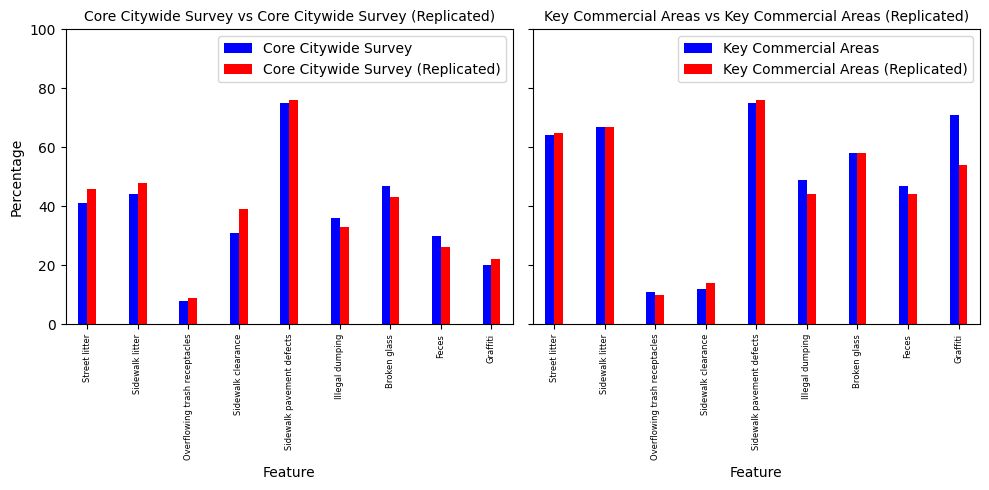
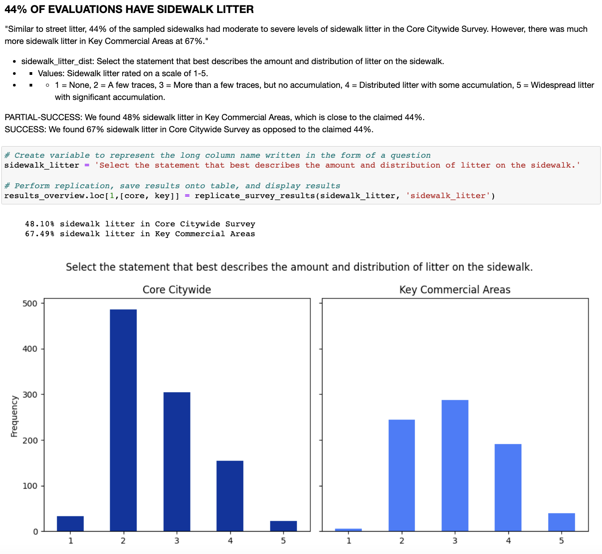

# 2022 SF DPW Streets & Sidewalk Evaluation Results (Replication)

This repo contains all the files for a project that attempts to replicate the results for a 2022 Streets and Sidewalk Evaluation. All the code is written and run in a Jupyter Notebook. 

## Original Study
Here's the link to the original study published by the SF Controller's Office, last updated May 22, 2023.

[2022 Street & Sidewalk Maintenance Standards Report
](https://sf.gov/reports/may-2023/2022-street-sidewalk-maintenance-standards-report)

## Replication results
Here are the results of my replication.
Feature | Core Citywide Survey | Key Commercial Areas | Core Citywide Survey (Replicated) | Key Commercial Areas (Replicated)
--- | --- | --- | --- | ---
Street litter | 41.0 | 64.0 | 46.0 | 65.0
Sidewalk litter | 44.0 | 67.0 | 48.0 | 67.0
Overflowing trash receptacles | 8.0 | 11.0 | 9.0 | 10.0
Sidewalk clearance | 31.0 | 12.0 | 39.0 | 14.0
Sidewalk pavement defects | 75.0 | 75.0 | 76.0 | 76.0
Illegal dumping | 36.0 | 49.0 | 33.0 | 44.0
Broken glass | 47.0 | 58.0 | 43.0 | 58.0
Feces | 30.0 | 47.0 | 26.0 | 44.0
Graffiti | 20.0 | 71.0 | 22.0 | 54.0

Note. This table shows the percentage of an uncleanliness feature’s prevalence for “Core Citywide Survey” and “Key Commercial Areas” and their respective “Replicated Values”. The graph below makes this easier to understand and digest visually.

## Graph Summary
Here's two charts displaying the results for the "Core Citywide Survey" and the "Key Commercial Areas". 

Note. There are two charts in this figure. For each chart, we have on the x-axis the name of the uncleanliness ‘Features’, and a shared y-axis of the percentage prevalence. In blue, we have the values for subcategory by either ‘'Core Citywide Survey' and ‘Key Commercial Areas’. In red right next to it, we have the replicated values. As we can see, although there are no glaring discrepancies, there are slight ones. For the Core Citywide Survey, the most visible differences are in ‘Street litter’, ‘Sidewalk litter’ and ‘Sidewalk clearance’ with a 3-5% difference. For the Key Commercial Areas, the most visible differences are in ‘Illegal dumping’ and ‘Graffiti’. 

## Example Replication Code
Here's one example chunk of the Jupyter Notebook that runs the custom function I created to replicate each result.

Note. This is a screenshot example of one code cell wherein I use my custom “replicate_survey_results()” to do a few things: calculate the percentage for Core Citywide and Key Commercial Areas, visualize the histogram distribution of all their possible values, then store their values onto the results_overview table. In this figure, we’re replicating the result ‘44% of evaluations have sidewalk litter’.

## Original Results
Here is a table of the original survey results.
| Feature                        | Core Citywide Survey (% issue present) | Key Commercial Areas (% issue present) |
|-------------------------------|---------------------------------------|----------------------------------------|
| Street litter                 | 41% moderate to severe                | 64% moderate to severe                |
| Sidewalk litter               | 44% moderate to severe                | 67% moderate to severe                |
| Overflowing trash receptacles | 8%                                    | 11%                                    |
| Sidewalk clearance            | 31%                                   | 12%                                    |
| Sidewalk pavement defects     | 75% moderate to severe                | 75% moderate to severe                |
| Illegal dumping               | 36%                                   | 49%                                    |
| Broken glass                  | 47%                                   | 58%                                    |
| Feces                         | 30%                                   | 47%                                    |
| Syringes                      | 1%                                    | 3%                                     |
| Condoms                       | 0.1%                                  | 0.5%                                   |
| Dead animals                  | 5%                                    | 0.5%                                   |
| Odors                         | 2%                                    | 3%                                     |
| Graffiti                      | 20% moderate to severe                | 71% moderate to severe                |
| Transit shelters              | 83%                                   | 91%                                    |